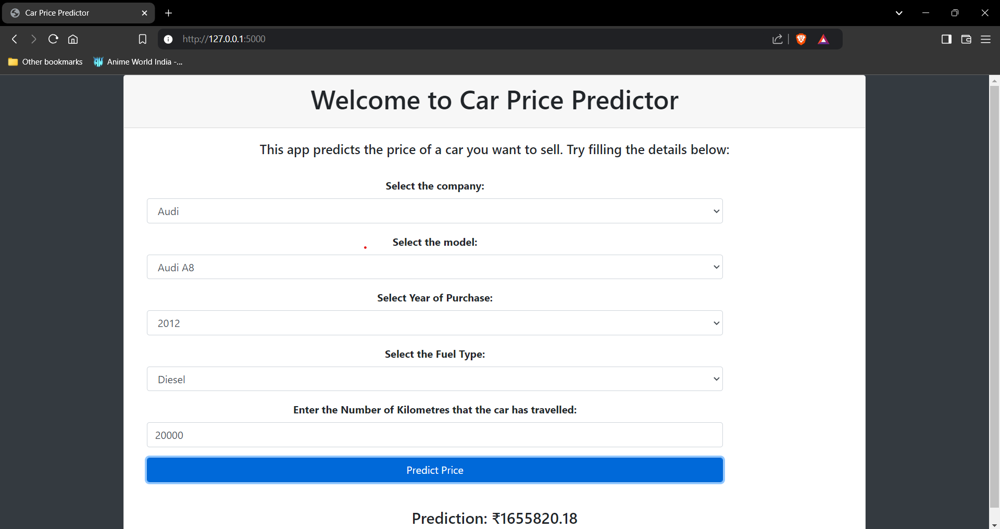

# Car Price Predictor
This project aims to predict the price of used cars based on various features such as the car's brand, model, year of manufacture, fuel type, and kilometers driven. The model is built using a linear regression algorithm.
## Table of Contents

- [Introduction](#introduction)
- [Features](#features)
- [Installation](#installation)
- [Usage](#usage)
- [Dataset](#dataset)
- [Model](#model)
- [Results](#results)
- [Contributing](#contributing)
- [License](#license)
- [Contact](#contact)

## Introduction

The Car Price Predictor is a machine learning project aimed at predicting the prices of cars based on various features such as brand, model, year, mileage, and more. The project uses regression techniques to provide accurate price estimates, helping buyers and sellers make informed decisions.

## Features

- Predict car prices based on multiple features
- Interactive web interface for easy input
- Visualizations of feature importance and model performance
- Support for various car brands and models

## Installation

To run this project locally, follow these steps:

1. **Clone the repository:**

   ```bash
   git clone https://github.com/SagarNikam09/Car_Price_Predictor.git
   cd Car_Price_Predictor
   ```

2. **Create and activate a virtual environment:**

   ```bash
   python -m venv venv
   source venv/bin/activate  # On Windows, use `venv\Scripts\activate`
   ```

3. **Install the required dependencies:**

   ```bash
   pip install -r requirements.txt
   ```

## Usage

1. **Prepare your dataset**: Ensure you have your dataset in the `data/` directory or specify its path in the configuration file.

2. **Run the application**:

   ```bash
   python app.py
   ```

3. **Access the web interface**: Open your browser and go to `http://localhost:5000` to use the car price predictor.

## Data

### Raw Dataset: `quikr_car.csv`

The initial dataset, `quikr_car.csv`, was sourced from Quikr, an online classifieds platform. This dataset contains raw information about used cars, including:

- **Name**: The model name of the car.
- **Company**: The brand or manufacturer of the car.
- **Year**: The year the car was manufactured.
- **Kilometers Driven**: The total distance the car has been driven.
- **Fuel Type**: The type of fuel the car uses (e.g., Petrol, Diesel).
- **Price**: The selling price of the car.

### Processed Dataset: `AferEDA_Car_data.csv`

## Model

The model is built using a linear regression algorithm, with hyperparameter tuning to optimize performance. Feature engineering and selection are applied to improve prediction accuracy.

## Output


## Contributing

Contributions are welcome! If you'd like to contribute to this project, please follow these steps:

1. Fork the repository
2. Create a new branch (`git checkout -b feature/YourFeature`)
3. Commit your changes (`git commit -m 'Add YourFeature'`)
4. Push to the branch (`git push origin feature/YourFeature`)
5. Open a Pull Request

## License

This project is licensed under the MIT License. See the [LICENSE](LICENSE) file for details.

## Contact

For any questions or inquiries, please contact Sagar Nikam at [sagar@example.com](mailto:sagar@example.com).

---

### Notes

- Replace placeholder URLs, email addresses, and example details with actual information specific to your project.
- Update the "Results" section with real results from your model's performance.
- Add any additional sections or modify existing ones to better fit your project's needs.

This README should provide a comprehensive overview of your Car Price Predictor project, helping users understand and utilize your work effectively. If you have any specific details you'd like to add or adjust, let me know!
